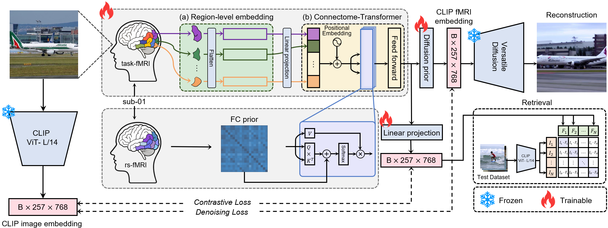
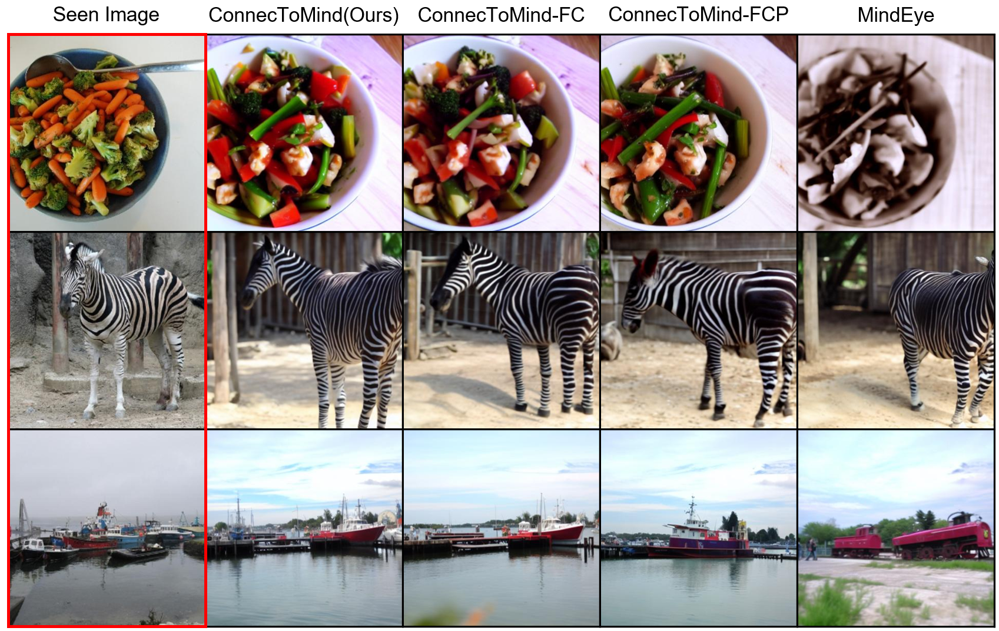

# ConnecToMind
### ConnecToMind: Connectome-Aware fMRI Decoding for Visual Image Reconstruction
---



For a comprehensive description of our methodology and results, please refer to our paper:
📄[ConnecToMind]()

## Dataset
We utilize multi-modal neuroimaging data (T1-weighted MRI, rs-fMRI, and task-fMRI) from the **Natural Scenes Dataset(NSD)**, which provides high-resolution 7-Tesla MRI data from eight participants. 
Following prior work, we use subject 1 data, who completed 28,577 task-fMRI trials with 9,519 unique images from the COCO dataset.
### Data Preparation
To prepare the dataset for the model input, please use the provided preprocessing scripts:
```bash
python download_beta.py
python preprocess_beta.py
python additional_files.py
```

## Usage Guide
### 1. Clone repository
```bash
git clone https://github.com/aimed-gist/ConneToMind
cd ConnecToMind
```
### 2. Install dependencies
```bash
pip install -r requirements.txt
```

### 3. Run the model
```bash
#ConnecToMind
python neural_decoding/main.py --device "cuda:3" --is_fc --is_position --fmri_detail_dir "beta_hf_dk" --experiment_name "fc(1)_learnable_layer1" --batch_size 160 --inference_batch_size 25 --prefetch_factor 10 --num_workers 30
#ConnecToMind-FC
python neural_decoding/main.py --device "cuda:0" --no-is_fc --is_position --experiment_name "learnable_layer1" --fmri_detail_dir "beta_hf_dk" --inference_batch_size 300 --is_shuffle
#ConnecToMind-FCP
python neural_decoding/main.py --device "cuda:1" --no-is_fc --no-is_position --experiment_name "vanila_layer1" --fmri_detail_dir "beta_hf_dk" --inference_batch_size 300 --is_shuffle

#ConnecToMind-L
python neural_decoding/main.py --device "cuda:3" --is_fc --is_position --fmri_detail_dir "beta_hf_dk" --experiment_name "fc(1)_learnable_layer1_lowx" --batch_size 160 --inference_batch_size 25 --prefetch_factor 10 --num_workers 30 
#ConnecToMind-H
python neural_decoding/main.py --device "cuda:0" --is_fc --is_position --fmri_detail_dir "beta_hf_dk" --experiment_name "fc(1)_learnable_layer1_highx" --batch_size 90 --inference_batch_size 10 --prefetch_factor 5 --num_workers 10 

#Retrieval
python neural_decoding/main.py --device "cuda:2" --is_fc --is_position --fmri_detail_dir "beta_hf_dk" --experiment_name "fc(1)_learnable_layer1" --inference_batch_size 300 --is_shuffle
```


## Model Performance

For more details, please refer to our [research paper]().